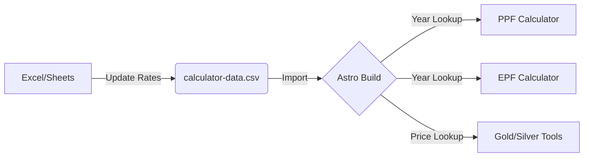

# Project Core structure: Data-Driven Architecture

This document explains the "Single Source of Truth" architecture used in this project to handle data that changes over time (like interest rates, gold prices, and tax slabs).

## 1. The Problem
Financial tools often rely on values that are revised periodically by the government or markets:
- **PPF/EPF Rates**: Changed quarterly or annually.
- **Gold/Silver Prices**: Change daily.
- **Tax Slabs**: Changed during the Union Budget.

Hardcoding these values directly into the components (`const rate = 7.1`) makes the project difficult to maintain and prone to errors.

## 2. Our Solution: The Lookup Table System

We separate the **Logic** from the **Data**.

### A. Data Layer (`/src/data/*.csv`)
All time-varying values are stored in simple CSV files. You can open these in **Excel** or **Google Sheets**.

**Example: `calculator-data.csv`**
| Year_Starting | PPF_Rate | EPF_Rate | Gold_Rate_24K |
| :--- | :--- | :--- | :--- |
| 2023 | 7.1 | 8.15 | 60000 |
| 2024 | 7.1 | 8.25 | 63000 |
| 2025 | 7.1 | 8.25 | 65000 |

### B. Logic Layer (The "Lookup Engine")
When a calculator (like PPF) runs for a 15-year period, it doesn't use one fixed number. Instead, it follows this algorithm:

1. **Iteration**: For every year of the calculation...
2. **Query**: Ask the data layer: *"What was the rate for the year X?"*
3. **Match**: 
    - If a specific rate is found for Year X, use it.
    - If Year X is in the future and no rate is defined yet, use the **Latest Available Rate**.
4. **Calculate**: Apply the specific rate to that year's balance.

## 3. Benefits of this Structure

### 🚀 Scalability
Want to add Silver prices? Just add a `Silver_Rate` column to the CSV. No need to rewrite the search or storage logic.

### 🛠️ Maintenance (Non-Coder Friendly)
You don't need to be a developer to update the website.
- **Step 1**: Open the CSV in Excel.
- **Step 2**: Add the new rate for the current year.
- **Step 3**: Save and Push. The website updates automatically.

### 📈 Historical Accuracy
Calculators will reflect real-world history. A PPF calculation starting in 2018 will correctly use 8.0%, then 7.9%, then 7.1%, providing a much more accurate result than a "flat rate" calculator.

## 4. Implementation Workflow



## 5. Directory Mapping
- `src/data/`: Contains all CSV/JSON data files.
- `src/components/Finance/`: Components that "consume" this data.
- `src/utils/dataFetcher.ts`: (Planned) Shared utility to handle the lookup logic across all tools.

## 6. Data Segmentation (Multi-Sheet Strategy)

Since different data types have different frequencies, we split them into specialized CSV files (sheets):

### A. Periodic Rates (`periodic-rates.csv`)
Used for **PPF, EPF, and Bank Interests**.
- **Update Frequency**: Every quarter or year.
- **Structure**: Date indexed (e.g., `2024-04-01`).
- **Logic**: The rate remains the same until a new date entry is found.

### B. Daily Prices (`daily-prices.csv`)
Used for **Gold, Silver, and Commodities**.
- **Update Frequency**: Daily or weekly.
- **Structure**: Specifically for historical chart tracking or latest price display.

## 7. Technical Implementation: The "Smart Lookup"

How does the PPF calculator actually get the interest rate?

### Step 1: The Build-time Export
Astro converts our CSV files into a fast JSON format during the build process.

### Step 2: The JavaScript Lookup Function
We use a shared function `getRateForDate(date, tool)`:

```javascript
function getRateForDate(targetDate, toolType) {
    // 1. Sort the data by date (descending)
    const sortedRates = data[toolType].sort((a, b) => b.date - a.date);
    
    // 2. Find the first entry that is less than or equal to our target date
    const match = sortedRates.find(entry => entry.date <= targetDate);
    
    // 3. Return the rate, or the latest available rate as fallback
    return match ? match.rate : sortedRates[0].rate;
}
```

### Step 3: Calculation Loop
When calculating PPF over 15 years, the code runs this loop:
1. Start at Year 1 (e.g., 2020).
2. Call `getRateForDate('2020-04-01', 'PPF')` → Returns 7.1%.
3. Move to Year 2 (2021).
4. Call `getRateForDate('2021-04-01', 'PPF')` → Returns 7.1%.
5. If you update the CSV with a new rate for 2026, the loop will automatically pick it up for those future years!

## 8. Why this matters for the USER
- **Trust**: Users see that the calculator uses *real* historical data, not just a guess.
- **Control**: You can "forecast" future scenarios by adding projected rates into your spreadsheet (e.g., "What if Gold hits 80k in 2027?").
